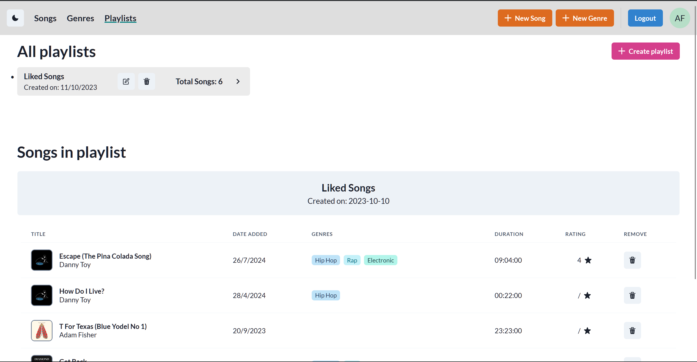
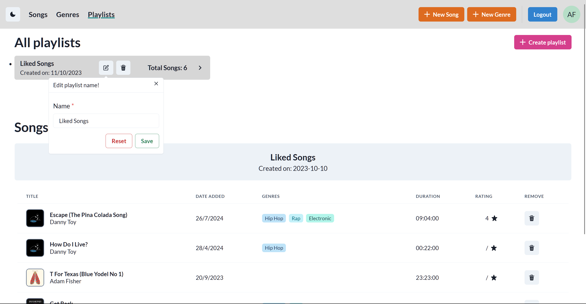
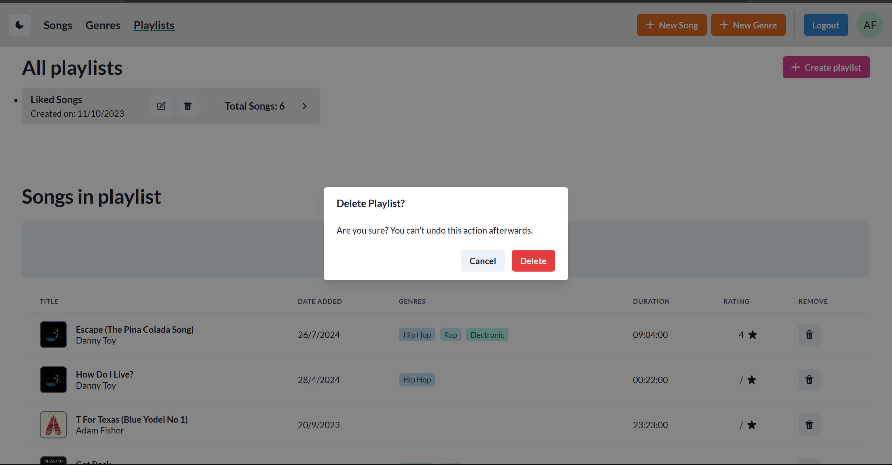
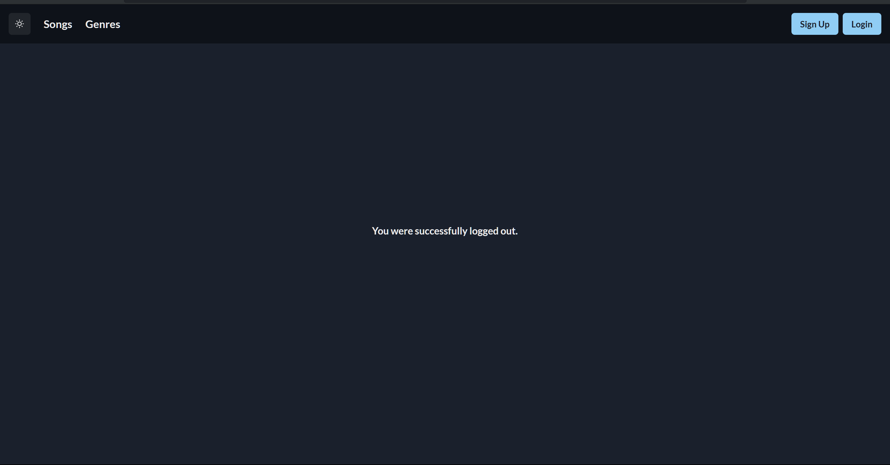

# Pushwant Sagoo (202187670)

- [x] Front-end Web Development:
  - https://github.com/Web-IV/2324-frontendweb-PushwantSagoo
  - https://two324-frontendweb-pushwantsagoo.onrender.com
- [x] Web Services:
  - https://github.com/Web-IV/2324-webservices-PushwantSagoo
  - https://two324-webservices-pushwantsagoo.onrender.com

**Logingegevens**

Bepaalde pagina's zijn openbaar en vereisen geen account.

- Lege accounts, het zijn enkel gebruikers zonder enige gerelateerde data.

  1. **_Artist_** account
     - Gebruikersnaam/e-mailadres: **Artist** - **artist@app.com**
     - Wachtwoord: **1234567890**
  2. **_Admin_** account
     - Gebruikersnaam/e-mailadres: **Admin** - **admin@app.com**
     - Wachtwoord: **1234567890**
  3. **_User_** account
     - Gebruikersnaam/e-mailadres: **User** - **user@app.com**
     - Wachtwoord: **1234567890**

- Gegenereerde accounts met mock data, om alle functionaliteiten in werking te zien.
  1. **_Artist_** account
     - Gebruikersnaam/e-mailadres: **Adam Fisher** - **Adam_Fisher18@gmail.com**
     - Wachtwoord: **1234567890**
  2. **_Admin_** account
     - Gebruikersnaam/e-mailadres: **Elenor Schowalter** - **Elenor78@yahoo.com**
     - Wachtwoord: **1234567890**
  3. **_User_** account
     - Gebruikersnaam/e-mailadres: **Jayme Durgan** - **Jayme.Durgan89@gmail.com**
     - Wachtwoord: **1234567890**

## Projectbeschrijving

EERD:

Mijn project begon als een heel versimpelde versie van bekende muziek streaming apps zoals Spotify en YouTube Music, maar na veel tijd (1ste zitijd) verloren aan dit idee een werkelijkheid te maken vooral eerst in de backend, besefte ik dat dit te ambitieus was. Hierdoor kon ik nauwelijks aan de frontend werken.

Oorspronkelijk was dit het idee: er zijn twee soorten gebruikers (`User` tabel), een normale gebuiker en een artiest gebruiker (`isArtist` in tabel). Een normale gebruiker kan meerdere playlist (`Playlist` tabel) aanmaken en ook liedjes er aan toevoegen (`PlaylistSong` en `Song` tabel). Daarnaast kan deze gebruiker ook een rating (tussen 1 - 5 sterren) (`UserSongsRating` tabel) aan de liedjes geven. Verder kan een normale gebruiker aangeven welke genres (`UserGenrePreference` en `Genre` tabel), hij/zij graag naar luistert, en deze zullen dienen om aan de gebruiker aanbevelingen te doen. Een artiest gebruiker kan al dit ook maar hij/zij kan ook nieuwe liedjes en nieuwe genres toevoegen (`Genre`, `Song`, en `SongGenre` tabel), en eigen publieke pagina wijzigen. De admin gebruiker kan uiteraad alles doen maar hij/zjn speelt op de achtergrond.

Dat terzijde, wat volgt is het realistische beeld van de doel van het project. Dit project is meer een tech demo of om web development te leren, maar het dient ook als een plaats waar je meta data over bepaalde liedjes kan opzoeken en opslaan op een gepersionaaliseerde manier. De bovenvermelde functionaliteiten zijn allemaal verwerkt geweest in de backend maar helaas niet in de frontend, er mist de functionaliteit om ratings te geven en om genre aanbevelingen te doen.

## Screenshots

Er zijn telkens twee screenshots die de twee kleur modus voorstellen; light en dark thema.

**Enkel voor artiest gebruiker:**

## API calls

> Maak hier een oplijsting van alle API cals in jouw applicatie. Groepeer dit per entiteit. Hieronder een voorbeeld.

### Gebruikers

- `GET /api/users`: alle gebruikers ophalen
- `GET /api/users/:id`: gebruiker met een bepaald id ophalen

### Genre

- get '/' - alle genres
- get '/:id' - bepaalde genre met al zijn liedjes
- post '/' - nieuwe genre
- put '/:id' - genre naam aanpassen
- delete '/:id' - genre verwijderen

### Playlist

- get '/'
- get '/:id'
- post '/'
- put '/:id'
- delete '/:id'
- post '/:id/songs'
- delete '/:id/songs/:songId'

...

## Behaalde minimumvereisten

> Duid per vak aan welke minimumvereisten je denkt behaald te hebben

### Front-end Web Development

- **componenten**

  - [x] heeft meerdere componenten - dom & slim (naast login/register)
  - [x] applicatie is voldoende complex
  - [x] definieert constanten (variabelen, functies en componenten) buiten de component
  - [x] minstens één form met meerdere velden met validatie (naast login/register)
  - [x] login systeem
         

- **routing**

  - [x] heeft minstens 2 pagina's (naast login/register)
  - [x] routes worden afgeschermd met authenticatie en autorisatie
         

- **state-management**

  - [x] meerdere API calls (naast login/register)
  - [x] degelijke foutmeldingen indien API-call faalt
  - [x] gebruikt useState enkel voor lokale state
  - [x] gebruikt gepast state management voor globale state - indien van toepassing
         

- **hooks**

  - [x] gebruikt de hooks op de juiste manier
         

- **varia**

  - [ ] een aantal niet-triviale e2e testen
  - [x] minstens één extra technologie
  - [x] maakt gebruik van de laatste ES-features (async/await, object destructuring, spread operator...)
  - [x] duidelijke en volledige README.md
  - [ ] volledig en tijdig ingediend dossier en voldoende commits

### Web Services

- **datalaag**

  - [x] voldoende complex (meer dan één tabel, 2 een-op-veel of veel-op-veel relaties)
  - [x] één module beheert de connectie + connectie wordt gesloten bij sluiten server
  - [x] heeft migraties - indien van toepassing
  - [x] heeft seeds
         

- **repositorylaag**

  - [x] definieert één repository per entiteit (niet voor tussentabellen) - indien van toepassing
  - [x] mapt OO-rijke data naar relationele tabellen en vice versa - indien van toepassing
         

- **servicelaag met een zekere complexiteit**

  - [x] bevat alle domeinlogica
  - [x] bevat geen SQL-queries of databank-gerelateerde code
         

- **REST-laag**

  - [x] meerdere routes met invoervalidatie
  - [x] degelijke foutboodschappen
  - [x] volgt de conventies van een RESTful API
  - [x] bevat geen domeinlogica
  - [x] geen API calls voor entiteiten die geen zin hebben zonder hun ouder (bvb tussentabellen)
  - [x] degelijke authorisatie/authenticatie op alle routes
         

- **algemeen**

  - [x] er is een minimum aan logging voorzien
  - [x] een aantal niet-triviale integratietesten (min. 1 controller >=80% coverage)
  - [x] minstens één extra technologie
  - [x] maakt gebruik van de laatste ES-features (async/await, object destructuring, spread operator...)
  - [x] duidelijke en volledige README.md
  - [ ] volledig en tijdig ingediend dossier en voldoende commits

## Projectstructuur

### Front-end Web Development

Componenten en Pagina's in mappen van hun eigen entiteiten.
Hiërarchie van componenten, pagina's bestaan uit componenten die opzich uit kleinere componenten bestaan. Zoveel mogelijk herbruik van componenten.

### Web Services

Gedeelde lagen, rest laag weet niets van service laag. Alles gestructureerd in mappen.

## Extra technologie

### Front-end Web Development

Chakra-ui: https://www.npmjs.com/package/@chakra-ui/react
Chakra-react-select: https://www.npmjs.com/package/chakra-react-select

### Web Services

Objection: https://www.npmjs.com/package/objection

## Testresultaten

### Front-end Web Development

### Web Services

De testen die falen omdat ik wijzigingen heb gedaan zonder de testen ook te updaten maar vroeger lukten ze allemaal.

## Gekende bugs

### Front-end Web Development

Geen(?)

### Web Services

Geen

## Wat is er verbeterd/aangepast?

### Front-end Web Development

- /

### Web Services

- Meer data meegeven met elke query (waardoor de testeb niet mee overeenkomen.)
